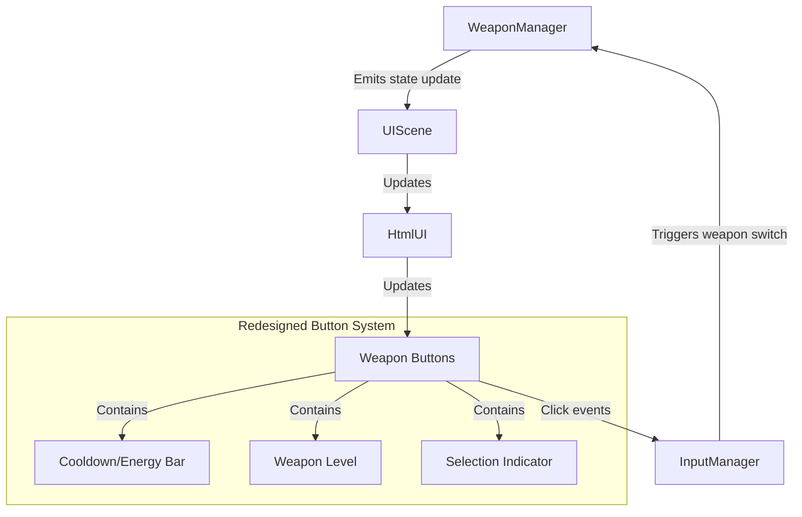

# Weapon UI Redesign Plan

## Current Issues Identified

1. **Button Positioning Issues**:
   - Weapon buttons are in the wrong position, often overlapping with other UI elements
   - Selection indicators don't work properly
   - Buttons aren't integrated with weapon state (cooldown/energy)

2. **Selection/Highlighting Problems**:
   - Default weapon isn't selected/highlighted on page load
   - Active weapon isn't properly visually distinct

3. **Integration Issues**:
   - Weapon cooldown/energy states aren't well integrated with buttons
   - Inconsistent behavior between different weapon types (regular weapons vs. energy-based weapons)

4. **UI Clutter**:
   - Redundant "Weapon: X Lvl: Y" text when buttons already show selection
   - Upgrade cost overlaps with buttons when they're properly positioned

## Root Causes

After analyzing the code, I've identified several architectural issues:

1. **Button Container Isolation**: The weapon buttons are created in a separate container outside the main UI hierarchy, making it difficult to maintain consistent positioning.

2. **Inconsistent State Management**: The weapon selection state isn't properly initialized on page load, causing the default weapon to not be highlighted.

3. **Visual Integration Gaps**: Cooldown/energy indicators are implemented separately from the selection UI, creating visual disconnects.

4. **Limited Positioning Logic**: The current approach to button positioning doesn't account for different screen sizes and canvas positions.

## Solution Architecture



## Key Design Changes

### 1. Integrated Button Container

Integrate the weapon buttons directly within the main UI container:

- Move buttons from separate container into the main UI hierarchy
- Position them consistently relative to the canvas
- Ensure they scale properly with canvas resizes

### 2. Comprehensive Button Elements

Each button should be a complete UI component that includes:

- Weapon name and number (1: Bullet, 2: Laser, etc.)
- Current weapon level indicator
- Integrated cooldown/energy bar
- Clear visual selection state

### 3. Proper State Initialization

- Ensure the default weapon is selected when the game starts
- Explicitly set active state for the default weapon
- Fix comparison issues in the weapon selection logic

### 4. Improved Layout

- Position upgrade cost display to avoid overlap with buttons
- Remove redundant "Weapon: X Lvl: Y" text
- Use CSS classes instead of inline styles for better organization

## Implementation Plan

### 1. HtmlUIFactory.ts Modifications

- Restructure button creation to integrate within main UI
- Implement proper hierarchical button components
- Fix positioning and scaling logic

### 2. HtmlUIComponents.ts Updates

- Refactor updateWeaponButtons function for reliability
- Ensure weapon ID comparisons work consistently
- Enhance visual feedback for the active weapon

### 3. WeaponManager.ts Improvements

- Fix proper state emission on startup
- Ensure state updates include all necessary information
- Handle weapon switching more reliably

### 4. CSS Styling

- Create dedicated CSS classes for weapon buttons
- Define active state styling
- Implement cooldown/energy bar visualizations
- Handle responsive sizing

### 5. UIScene.ts Updates

- Ensure proper processing of weapon state updates
- Add initialization code for default selection
- Fix event handling

## Technical Specifications

### Button Component Structure

```html
<div class="weapon-button" data-weapon="bullet">
  <div class="weapon-name">1: Bullet</div>
  <div class="weapon-level">Lvl 1</div>
  <div class="progress-container">
    <div class="progress-bar"></div>
  </div>
</div>
```

### CSS Styling

```css
.weapon-button {
  position: relative;
  display: flex;
  flex-direction: column;
  justify-content: space-between;
  padding: 8px;
  border-radius: 6px;
  background-color: #555555;
  color: #dddddd;
  min-width: 80px;
  min-height: 60px;
  text-align: center;
  cursor: pointer;
  user-select: none;
  border: 2px solid transparent;
}

.weapon-button.active-weapon {
  background-color: #888800;
  color: #ffff00;
  border-color: #ffff00;
}

.progress-container {
  position: relative;
  height: 4px;
  width: 100%;
  background-color: rgba(0, 0, 0, 0.3);
  overflow: hidden;
}

.progress-bar {
  position: absolute;
  height: 100%;
  width: 0%;
  transition: width 0.05s linear;
}

/* Different colors for different weapon types */
.weapon-button[data-weapon="bullet"] .progress-bar {
  background-color: #ff0000;
}

.weapon-button[data-weapon="laser"] .progress-bar {
  background-color: #00ffff;
}

.weapon-button[data-weapon="slow_field"] .progress-bar {
  background-color: rgba(255, 215, 0, 0.7);
}
```

### Positioning Logic

```typescript
// Position the button container relative to the canvas
const canvasRect = this.canvas.getBoundingClientRect();
const buttonContainer = this.uiElements.get('weaponButtonContainer');
if (buttonContainer) {
  // Position it at the bottom center, but higher than before
  buttonContainer.style.left = `${canvasRect.width * 0.5}px`;
  buttonContainer.style.bottom = `${canvasRect.height * 0.15}px`;
  buttonContainer.style.transform = 'translateX(-50%)';
}
```

## Expected Outcomes

1. **Visual Consistency**: Buttons will have a consistent position and appearance
2. **Clear Selection**: The active weapon will be clearly highlighted
3. **Integrated State**: Cooldown/energy states will be visually integrated with buttons
4. **No Overlaps**: UI elements won't overlap or obscure each other
5. **Responsive Layout**: UI will adapt to different screen sizes and canvas positions

## Implementation Approach

The implementation should be done in stages:

1. First, restructure the button container and positioning logic
2. Next, implement the new button component structure
3. Then, fix the default weapon selection issue
4. Finally, improve the visual styling and state representation

After implementation, thorough testing should be done to ensure all weapon types (bullet, laser, slow_field) work correctly with their different cooldown/energy mechanisms.